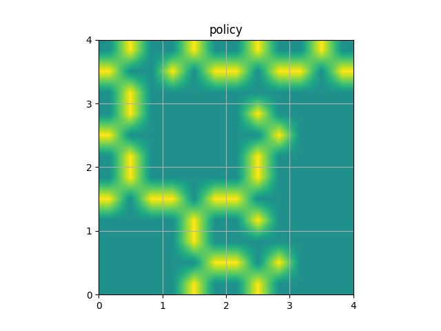
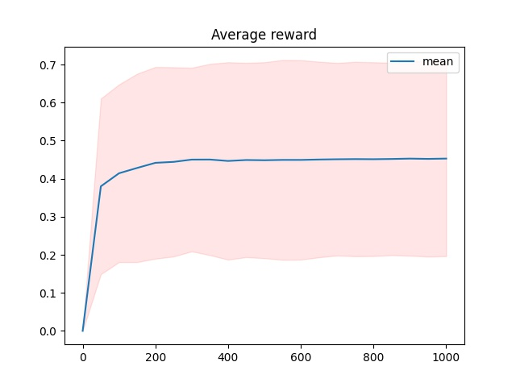

# Frozen Lake v0
ここでは穴に落ちた場合の報酬を $-1$に変換しています。
また、得られた報酬を 一足して二で割ったものに変換して表示しています。
これにより、0から1の間の報酬に変換されています。

## Result
下図は学習で得られた方策における各stateの最適行動を選んだ時に実際に移動する方向としてありうる方ものを黄色で強調した図です。

下図は学習する過程において、そのエピソードまでに得られた報酬の平均と誤差のグラフです。

また学習したエージェントを実際にプレイさせたときの平均報酬は `0.5184` でした
